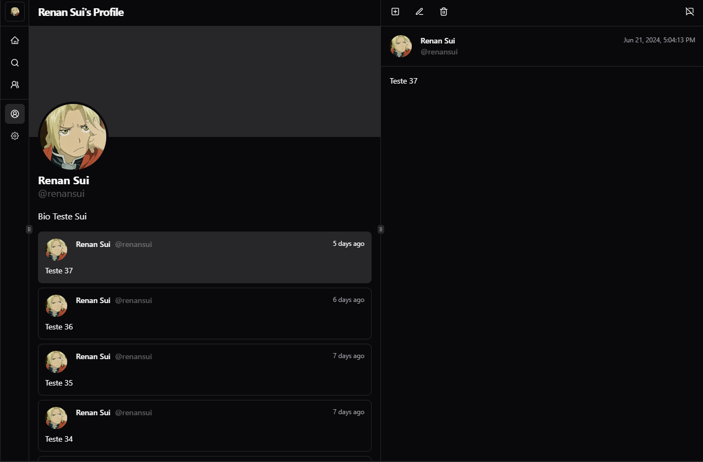

# [Remix-Blog](https://renansui-remix-blog.vercel.app)

Social Media & Microblogging service with interactive UI using React and Remix.
Bootstrapped with [`create-remix`](https://www.npmjs.com/package/create-remix).

[]([https://spenso.vercel.app](https://www.npmjs.com/package/create-remix))

## Tech Stack

- **Framework:** [Remix](https://remix.run)
- **Styling:** [Tailwind CSS](https://tailwindcss.com)
- **Database:** [NeonDB](https://neon.tech)
- **Form:** [React Hook Form](https://react-hook-form.com)
- **Toaster:** [Sonner](https://sonner.emilkowal.ski)
- **Component Library:** [Radix UI](https://www.radix-ui.com) + [Shadcn UI](https://ui.shadcn.com)

## Features

- Login and Logout.
- Create, View, Modify and Delete Posts.
- Edit your Profile.

## Running Locally

1. Clone the repository:

   ```bash
   git clone https://github.com/RenanSui/remix-blog.git
   ```

2. Install dependencies using pnpm:

   ```bash
   pnpm install
   ```

3. Copy the `.env.example` to `.env.local` and update the variables.

   ```bash
   cp .env.example .env.local
   ```

4. Start the development server:

   ```bash
   pnpm run dev
   ```

## How do I deploy this?

Follow the deployment guides for [Remix](https://remix.run/docs/en/main/guides/deployment), [Vercel](https://create.t3.gg/en/deployment/vercel), [Netlify](https://create.t3.gg/en/deployment/netlify) and [Docker](https://create.t3.gg/en/deployment/docker) for more information.

## License

Licensed under the MIT License. Check the [LICENSE](./LICENSE) file for details.
